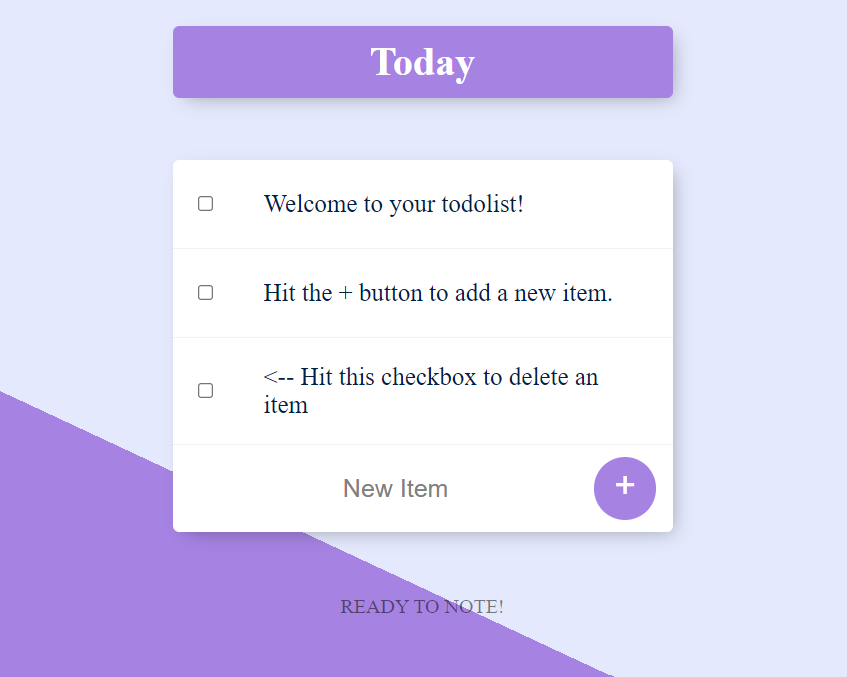
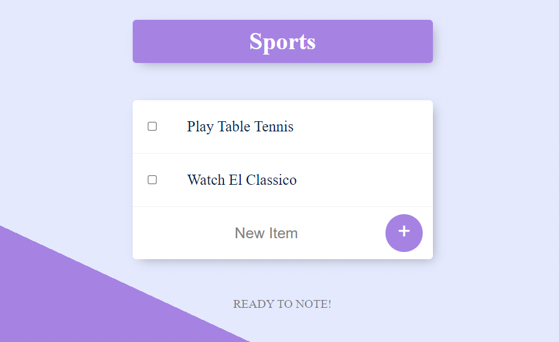

# todo_list
This is a todolist project inspired from Angela Yu's complete bootcamp todolist created using EJS, express, Mongo DB and Node.js.

## Table of contents

- [Overview](#overview)
  - [Description](#description)
  - [Screenshots](#screenshots)
  - [Links](#links)
- [My process](#my-process)
  - [Built with](#built-with)

## Overview

### Description

A todolist created using Mongo DB and ExpressJS.By using express routing you can create multiple lists of your interests and simply access each list whenever you want. Easy adding and deleting of items from each list you create!. 

### Screenshots

### Links

- Github Source Files: https://github.com/prasanta10/todo_list
- URL : will deploy ASAP.

## My process

### Built with

- Node JS
- Express JS
- EJS
- Mongo DB (connected using mongoose) 
- npm modules (body-parser, lodash)
- Basic HTML
- Intermediate CSS (Flexbox & CSS Grid)
